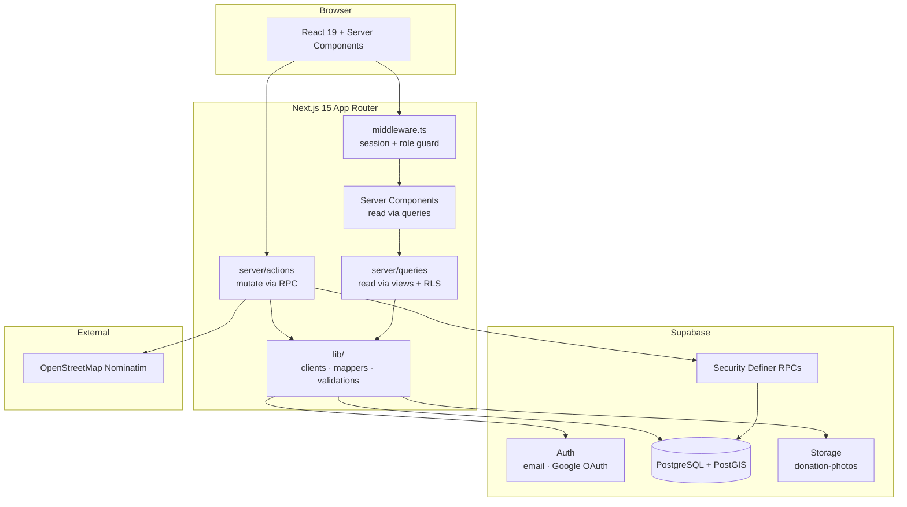
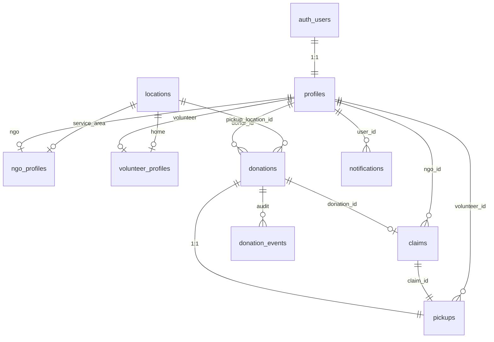
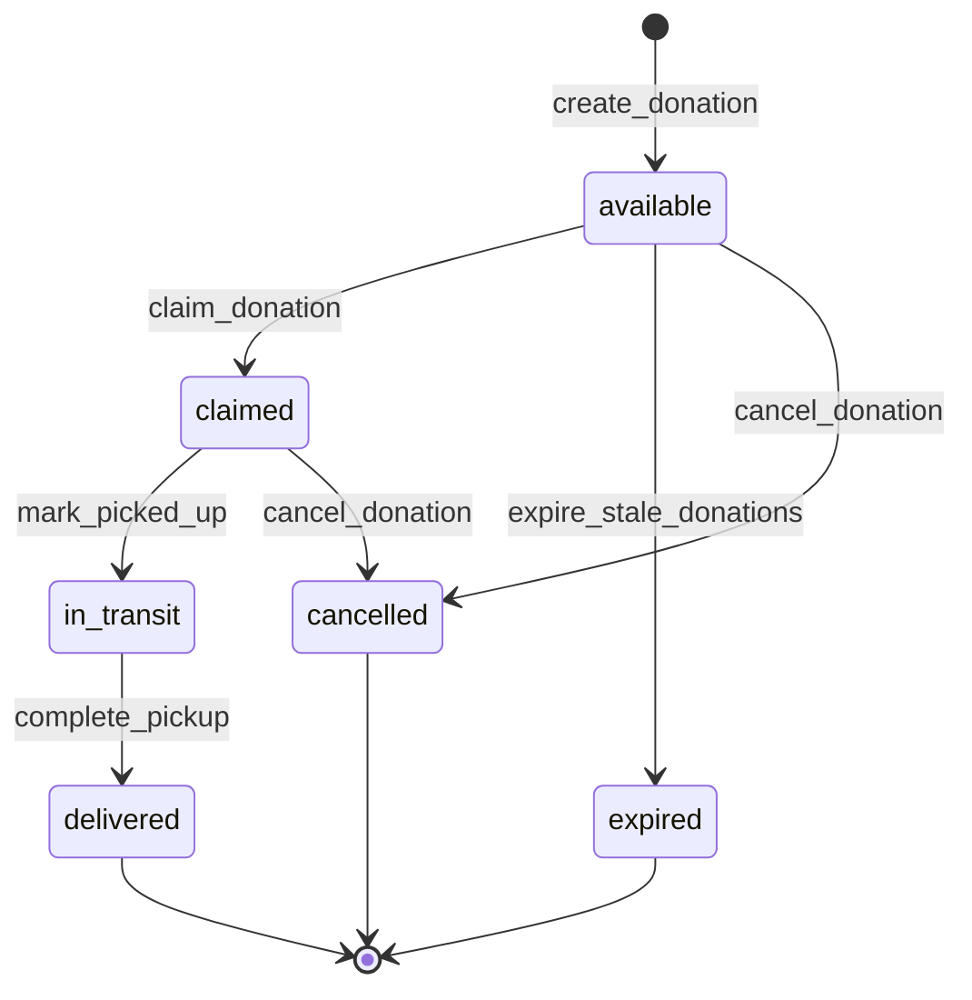
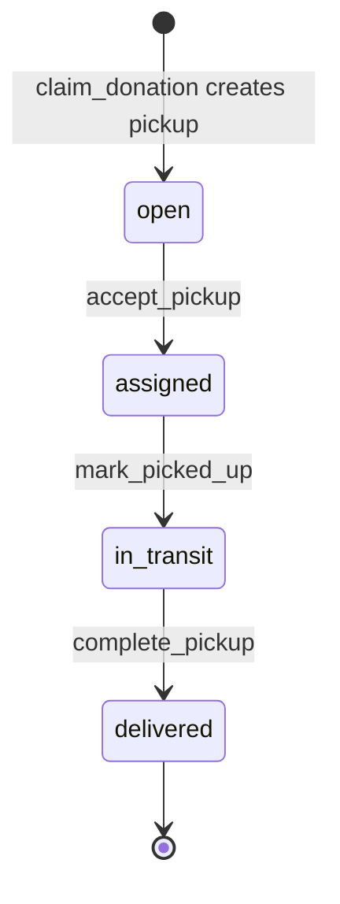
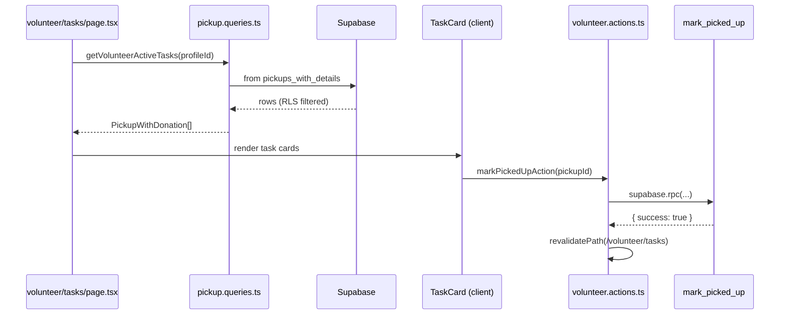
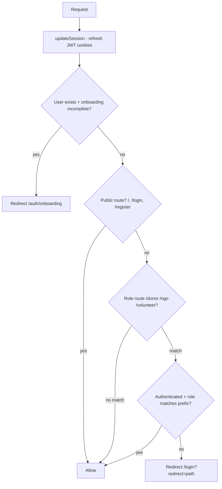

# foodbridge

**Bridging surplus food to people who need it.**

foodbridge connects **donors**, **NGOs**, and **volunteers** through a role-based web app. Surplus food is posted, claimed by NGOs, and delivered by volunteers — with every state change enforced in PostgreSQL, not in the browser.

This document explains the **backend architecture** end to end: database schema, security model, server layer, auth, and business workflows. A contributor quick-start is at the bottom.

---

## Table of contents

1. [Architecture at a glance](#architecture-at-a-glance)
2. [Tech stack](#tech-stack)
3. [Quick start](#quick-start)
4. [System design principles](#system-design-principles)
5. [Database schema](#database-schema)
6. [State machines](#state-machines)
7. [RPC catalog](#rpc-catalog)
8. [Row Level Security](#row-level-security)
9. [Server layer](#server-layer)
10. [Authentication & authorization](#authentication--authorization)
11. [Business workflows](#business-workflows)
12. [Storage & geocoding](#storage--geocoding)
13. [Environment variables](#environment-variables)
14. [Supabase setup](#supabase-setup)
15. [Project structure](#project-structure)
16. [Scripts & commands](#scripts--commands)
17. [Known gaps & roadmap](#known-gaps--roadmap)
18. [Contributing](#contributing)

---

## Architecture at a glance



### Request flow

| Operation | Path | Enforced by |
|-----------|------|-------------|
| **Read** (dashboards, lists, detail pages) | `page.tsx` → `server/queries/*` → Supabase view/table | RLS policies filter rows per user |
| **Write** (create donation, claim, pickup steps) | Form / button → `server/actions/*` → `supabase.rpc()` | PostgreSQL RPC functions (`SECURITY DEFINER`) |
| **Auth** | Every request → `middleware.ts` → `updateSession()` | JWT validation + `profiles.role` |

**Key design choice:** the app never writes directly to `donations`, `claims`, or `pickups` for business logic. All mutations go through atomic RPC functions that validate role, status, and geo constraints in a single transaction.

---

## Tech stack

| Layer | Technology |
|-------|------------|
| Framework | Next.js 15 (App Router), React 19, TypeScript |
| Styling | Tailwind CSS, shadcn/ui |
| Database | Supabase PostgreSQL + PostGIS |
| Auth | Supabase Auth (email/password, Google OAuth) |
| Storage | Supabase Storage (`donation-photos` bucket) |
| Validation | Zod (forms + `env.ts`) |
| Maps | Leaflet / react-leaflet |
| Geocoding | OpenStreetMap Nominatim (no API key) |

---

## Quick start

### Prerequisites

- Node.js 18+
- A [Supabase](https://supabase.com) project
- Git

### 1. Clone and install

```bash
git clone https://github.com/SoubhagyaJain/Food-Bridge.git
cd Food-Bridge
npm install
```

### 2. Environment

```bash
copy .env.example .env.local   # Windows
# cp .env.example .env.local   # macOS / Linux
```

Fill in `.env.local` (see [Environment variables](#environment-variables)).

### 3. Database

Run migrations in the Supabase SQL Editor — see [Supabase setup](#supabase-setup).

### 4. Run

```bash
npm run dev
```

Open **http://localhost:3002**

The dev script clears stale `.next` cache automatically to prevent webpack chunk errors.

---

## System design principles

### 1. RPC-first mutations

State changes (`create_donation`, `claim_donation`, `accept_pickup`, etc.) are implemented as PostgreSQL functions with `SECURITY DEFINER`. Benefits:

- **Atomicity** — donation status, claim, and pickup rows update together
- **Consistency** — status transitions validated in one place
- **Security** — app cannot bypass business rules via direct table writes
- **Auditability** — `donation_events` logged from RPCs

### 2. RLS-first reads

Server Components query views (`donations_with_address`, `pickups_with_details`) and tables. Row Level Security ensures users only see data their role permits — even if a query forgets a `.eq()` filter.

### 3. Thin server layer

```
server/queries/   → read-only, called from Server Components
server/actions/   → mutations, called from forms / client components
server/services/  → pure business logic (e.g. ranking — extensibility point)
lib/mappers/      → snake_case DB rows → camelCase domain types
lib/validations/  → Zod schemas shared by actions and forms
lib/rpc/errors.ts → maps RPC `error_code` → user-facing messages
```

### 4. Role isolation

Three roles (`donor`, `ngo`, `volunteer`) map to route prefixes (`/donor`, `/ngo`, `/volunteer`). Middleware enforces route access; RLS enforces data access; RPCs enforce write permissions.

---

## Database schema

### Entity relationship



### Enums

| Enum | Values |
|------|--------|
| `user_role` | `donor`, `ngo`, `volunteer` |
| `donation_status` | `available`, `claimed`, `in_transit`, `delivered`, `expired`, `cancelled` |
| `claim_status` | `pending`, `approved`, `rejected`, `fulfilled` |
| `pickup_status` | `open`, `assigned`, `in_transit`, `delivered`, `cancelled` |
| `food_unit` | `kg`, `lbs`, `meals`, `boxes`, `liters`, `items` |

### Core tables

| Table | Purpose |
|-------|---------|
| `locations` | PostGIS `geography(point, 4326)` + formatted address. Shared by donation pickup sites, NGO service areas, volunteer home locations. |
| `profiles` | 1:1 with `auth.users`. Role, onboarding flag, optional `role_switching_enabled` (dev/testing). |
| `ngo_profiles` | NGO org details, `service_location_id`, `service_radius_km`, `verified`. |
| `volunteer_profiles` | Home location, service radius, `is_available`. |
| `donations` | Food listing with quantity, unit, photo, expiry, status lifecycle. |
| `claims` | NGO claim on a donation. Auto-approved (`approved`) on creation. One active claim per donation (partial unique index). |
| `pickups` | 1:1 with donation. Volunteer assignment and 3-step delivery flow. |
| `donation_events` | Audit log: actor, old/new status, metadata JSON. |
| `notifications` | Per-user notifications (schema ready; no app UI yet). |

### Views

| View | Purpose |
|------|---------|
| `donations_with_address` | Donations joined with `locations` → `pickup_address`, `pickup_lat`, `pickup_lng` |
| `pickups_with_details` | Full pickup context: donation, claim, NGO contact, donor name |
| `locations_with_coords` | `id`, `formatted_address`, `lat`, `lng` |
| `volunteer_pickups` | Alias over `pickups` |

### Indexes (high-signal)

- `locations_point_gist` — GiST index on PostGIS point
- `claims_one_active_per_donation` — partial unique on active claims
- `pickups_open_status_idx` — partial index on `status = 'open'`
- `donations_status_expires_idx` — browse available + expiry sweeps

### Triggers

| Trigger | Function | Effect |
|---------|----------|--------|
| `on_auth_user_created` | `handle_new_user()` | Creates `profiles` row from signup metadata; auto-creates `ngo_profiles` for NGO role |
| `*_updated_at` | `set_updated_at()` | Auto-updates `updated_at` on row change |

---

## State machines

### Donation lifecycle



### Pickup lifecycle (volunteer 3-step flow)



| Step | UI action | RPC | Donation status change |
|------|-----------|-----|------------------------|
| Claim (NGO) | Claim donation | `claim_donation` | `available` → `claimed` |
| Accept (Volunteer) | Claim pickup | `accept_pickup` | stays `claimed` |
| Picked up | Mark picked up | `mark_picked_up` | → `in_transit` |
| Delivered | Mark delivered | `complete_pickup` | → `delivered`, claim → `fulfilled` |

---

## RPC catalog

All mutation RPCs return `{ success: boolean, ... }` or `{ success: false, error_code: text }`. Error codes are mapped in `lib/rpc/errors.ts`.

| RPC | Caller role | What it does |
|-----|-------------|--------------|
| `create_donation(...)` | Donor | Geocoded location insert + donation row + audit event |
| `claim_donation(p_donation_id, p_notes?)` | NGO | Validates availability, expiry, radius → claim + pickup + status update |
| `accept_pickup(p_pickup_id)` | Volunteer | Assigns volunteer, `open` → `assigned` |
| `mark_picked_up(p_pickup_id)` | Volunteer | `assigned` → `in_transit`, donation → `in_transit` |
| `complete_pickup(p_pickup_id)` | Volunteer | `in_transit` → `delivered`, claim → `fulfilled` |
| `cancel_donation(p_donation_id, p_reason?)` | Donor | Cancels `available` or `claimed` donations |
| `create_location(address, lat, lng)` | Volunteer | Creates home location for profile |
| `nearby_open_pickups(lat, lng, radius_km?)` | Volunteer | PostGIS radius search for open pickups |
| `nearby_available_donations(lat, lng, radius_km?)` | NGO | PostGIS radius search (exists; app uses RLS + view instead) |
| `expire_stale_donations()` | service_role | Batch expire past-due donations (no cron wired) |
| `log_donation_event(...)` | internal | Audit helper |

**RLS helper functions** (migration 009 — prevent policy recursion):

`auth_user_role()`, `user_owns_donation()`, `user_has_claim_on_donation()`, `user_volunteer_on_donation()`

---

## Row Level Security

RLS is enabled on all core tables. Summary:

| Table | Read access | Write access |
|-------|-------------|--------------|
| `profiles` | Own profile; active users visible for basics | Update own |
| `ngo_profiles` | Own; verified NGOs public | NGO insert/update own |
| `volunteer_profiles` | Own | Volunteer insert/update own |
| `locations` | Authenticated | Authenticated insert |
| `donations` | Donor: own; NGO: available in service radius + claimed; Volunteer: assigned | Donor update own (limited statuses); inserts via RPC only |
| `claims` | NGO own; donor on own donations | Inserts via RPC only |
| `pickups` | Volunteer: open + assigned; NGO: related; Donor: on own donations | Updates via RPC only |
| `donation_events` | Involved parties | RPC only |
| `notifications` | Own | Update own |

**Geo filtering for NGOs:** if `ngo_profiles.service_location_id` is set, RLS uses `ST_DWithin` to only show donations within `service_radius_km`.

**Geo filtering for volunteers:** `nearby_open_pickups` RPC uses PostGIS; app falls back to all open pickups if home location is unset.

---

## Server layer

### `server/actions/` — mutations

| File | Exports | RPC / side effects |
|------|---------|-------------------|
| `auth.actions.ts` | `loginAction`, `registerAction`, `signOutAction`, `signInWithGoogleAction`, `completeOnboardingAction` | Supabase Auth + admin client for profile bootstrap |
| `donation.actions.ts` | `createDonationAction` | Geocode → optional photo upload → `create_donation` |
| `claim.actions.ts` | `createClaimAction` | `claim_donation` |
| `volunteer.actions.ts` | `acceptPickupAction`, `markPickedUpAction`, `completePickupAction`, `updateVolunteerProfileAction` | Pickup RPCs + `create_location` + profile upsert |

**Action conventions:**

1. Validate input with Zod (`lib/validations/`)
2. Call `supabase.rpc()` — never direct inserts on protected tables
3. Check `isRpcSuccess()` from `lib/rpc/errors.ts`
4. `revalidatePath()` affected routes
5. `redirect()` on success or return `{ error: string }`

### `server/queries/` — reads

| File | Key functions | Data source |
|------|---------------|-------------|
| `donation.queries.ts` | `getDonationsByDonor`, `getAvailableDonations`, `getDonationById` | `donations_with_address` |
| `claim.queries.ts` | `getClaimsByNgo`, `getClaimCountByNgo` | `claims` + joins |
| `pickup.queries.ts` | `getNearbyOpenPickups`, `getVolunteerActiveTasks`, `getVolunteerHistory`, `getPickupById`, `getVolunteerImpactStats` | RPC + `pickups_with_details` |
| `volunteer.queries.ts` | `getVolunteerProfile`, `getVolunteerHomeCoords` | `volunteer_profiles` + `locations_with_coords` |
| `stats.queries.ts` | `getDonorStats`, `getNgoDashboardStats`, `getPlatformStats` | Aggregations |

### `server/services/`

| File | Status |
|------|--------|
| `matching.service.ts` | `rankDonationsForNgo()` — scores by urgency + distance. **Defined, not wired to UI.** |

### Data flow example



---

## Authentication & authorization

### Middleware flow



**Public routes:** `/`, `/login`, `/register`  
**Auth callback** (`/auth/callback`) is excluded from the middleware matcher.

### OAuth & onboarding

1. Google sign-in → `/auth/callback` exchanges code for session
2. If `profiles.onboarding_completed = false` → `/auth/onboarding` (role selection)
3. `completeOnboardingAction` sets role + creates `ngo_profiles` if NGO
4. Redirect to role dashboard

### Role switching (development)

Migration `010` adds `profiles.role_switching_enabled`. When `true`, login can select any role; `lib/auth/role-switch.ts` updates profile + auth metadata via the **service role** client.

### Supabase client matrix

| Client | File | Used when |
|--------|------|-----------|
| Server (SSR cookies) | `lib/supabase/server.ts` | Server Components, actions, queries |
| Browser | `lib/supabase/client.ts` | Client-side photo upload |
| Admin (service role) | `lib/supabase/admin.ts` | Profile bootstrap, role switch, NGO upsert |
| Middleware | `lib/supabase/middleware.ts` | Session refresh only |

---

## Business workflows

### Donor: post surplus food

```
NewDonationForm
  → createDonationAction
    → Zod validate (lib/validations/donation.ts)
    → geocode pickup address (lib/geo/geocode.ts)
    → upload photo to donation-photos/{userId}/ (optional)
    → rpc('create_donation')
    → redirect /donor/donations
```

### NGO: claim food for community

```
ClaimDonationForm
  → createClaimAction
    → rpc('claim_donation')
      → validates: available, not expired, within service radius
      → inserts claim (approved) + pickup (open)
      → donation → claimed
    → redirect /ngo/claims
```

NGO browse uses `getAvailableDonations()` — RLS handles geo filtering when service location is configured.

### Volunteer: rescue & deliver

```
Dashboard / Pickups
  → getNearbyOpenPickups(homeLat, homeLng, radius)  [RPC]
  → acceptPickupAction → accept_pickup

Tasks
  → getVolunteerActiveTasks
  → markPickedUpAction → mark_picked_up
  → completePickupAction → complete_pickup

Profile
  → updateVolunteerProfileAction
    → create_location (home address)
    → upsert volunteer_profiles
```

---

## Storage & geocoding

### Storage bucket: `donation-photos`

| Property | Value |
|----------|-------|
| Visibility | Public read |
| Max size | 5 MB |
| Types | JPEG, PNG, WebP |
| Path | `{donor_user_id}/{uuid}.{ext}` |
| Policies | Donors CRUD own folder; public read |

### Geocoding

`lib/geo/geocode.ts` calls OpenStreetMap Nominatim. No API key required. Falls back to Delhi coordinates (28.6139, 77.209) if geocoding fails.

Units are normalized via `lib/geo/units.ts` before RPC calls.

---

## Environment variables

| Variable | Required | Purpose |
|----------|----------|---------|
| `NEXT_PUBLIC_SUPABASE_URL` | Yes | Supabase project URL |
| `NEXT_PUBLIC_SUPABASE_PUBLISHABLE_KEY` | Yes | Anon/publishable key (SSR + browser) |
| `SUPABASE_SERVICE_ROLE_KEY` | Yes* | Admin client: profile bootstrap, role switch, NGO upsert |
| `NEXT_PUBLIC_APP_URL` | Yes | OAuth redirects, email confirm links. Use `http://localhost:3002` locally |

\*Without the service role key, OAuth onboarding and profile bootstrap will fail.

Legacy alias: `NEXT_PUBLIC_SUPABASE_ANON_KEY` is accepted as a fallback for the publishable key.

Validated at runtime by `env.ts` (Zod). Copy from `.env.example`:

```env
NEXT_PUBLIC_SUPABASE_URL=https://your-project-ref.supabase.co
NEXT_PUBLIC_SUPABASE_PUBLISHABLE_KEY=sb_publishable_your-key-here
SUPABASE_SERVICE_ROLE_KEY=sb_secret_your-key-here
NEXT_PUBLIC_APP_URL=http://localhost:3002
```

---

## Supabase setup

### Migration order (run in SQL Editor)

Apply **in this exact order**. Do not use legacy files (`schema.sql`, `setup-all.sql`, `002_rls_updates.sql`).

```
001_extensions_enums.sql      PostGIS + enums
002_core_tables.sql           Tables
003_audit_notifications.sql   donation_events + notifications
004_functions_triggers.sql    RPCs + triggers
005_rls_policies.sql          Row Level Security
006_storage.sql               donation-photos bucket
007_views_indexes.sql         Views + indexes
008_backfill.sql              Data backfill
009_fix_rls_recursion.sql     RLS helper functions (required)
010_role_switching.sql        Dev role switching
011_volunteer_portal.sql      Volunteer profiles + 3-step pickup flow
012_volunteer_pickup_donor.sql  donor_name in geo RPC + view
```

**Quick path:** paste `supabase/setup-v1.sql` (concatenates 001–008), then run 009–012 individually.

### Auth configuration (Supabase Dashboard)

1. **Authentication → URL Configuration**
   - Site URL: `http://localhost:3002`
   - Redirect URLs: `http://localhost:3002/auth/callback`
2. **Authentication → Providers → Google** (optional)
   - Redirect URI: `https://<project-ref>.supabase.co/auth/v1/callback`
3. **Regenerate types** after migrations:

```bash
npm run gen:types
```

---

## Project structure

```
foodbridge/
├── app/
│   ├── (marketing)/          # Public landing → /
│   ├── (auth)/               # Login, register
│   ├── (donor)/donor/        # Donor dashboard & donations
│   ├── (ngo)/ngo/            # NGO browse & claims
│   ├── (volunteer)/volunteer/ # Volunteer portal
│   └── auth/
│       ├── callback/         # OAuth code exchange
│       └── onboarding/       # Role selection (Google users)
├── components/
│   ├── ui/                   # shadcn primitives
│   ├── shared/               # ThemeProvider, Map, Navbar
│   └── features/             # donor · ngo · volunteer · marketing · auth
├── lib/
│   ├── supabase/             # server · client · admin · middleware · storage
│   ├── auth/                 # session, roles, role-switch
│   ├── mappers/              # DB rows → domain types
│   ├── validations/          # Zod schemas
│   ├── rpc/errors.ts         # RPC error_code → messages
│   └── geo/                  # geocode, distance, units
├── server/
│   ├── actions/              # Mutations (RPC calls)
│   ├── queries/              # Reads (views + tables)
│   └── services/             # Pure business logic
├── supabase/
│   └── migrations/           # 001–012 SQL migrations
├── types/
│   ├── donation.ts           # Domain types (camelCase)
│   └── database.types.ts     # Generated Supabase types
├── scripts/
│   ├── clean-cache.mjs       # Remove stale .next
│   └── dev.mjs               # Clean + start dev server
├── middleware.ts               # Session refresh + role guard
└── env.ts                      # Validated environment
```

### Route map

| URL | Role | Backend reads | Backend writes |
|-----|------|---------------|----------------|
| `/donor/dashboard` | Donor | `getDonorStats` | — |
| `/donor/donations/new` | Donor | — | `createDonationAction` |
| `/ngo/donations` | NGO | `getAvailableDonations` | — |
| `/ngo/donations/[id]` | NGO | `getDonationById` | `createClaimAction` |
| `/ngo/claims` | NGO | `getClaimsByNgo` | — |
| `/volunteer/dashboard` | Volunteer | stats + nearby pickups | — |
| `/volunteer/pickups` | Volunteer | `getNearbyOpenPickups` | — |
| `/volunteer/pickups/[id]` | Volunteer | `getPickupById` | pickup RPCs |
| `/volunteer/tasks` | Volunteer | `getVolunteerActiveTasks` | pickup RPCs |
| `/volunteer/history` | Volunteer | `getVolunteerHistory` | — |
| `/volunteer/profile` | Volunteer | `getVolunteerProfile` | `updateVolunteerProfileAction` |

---

## Scripts & commands

| Command | Purpose |
|---------|---------|
| `npm run dev` | Clear `.next` cache + start dev server on port **3002** |
| `npm run clean` | Remove `.next` cache manually |
| `npm run build` | Clean cache + production build |
| `npm run start` | Start production server (port 3002) |
| `npm run lint` | ESLint |
| `npm run typecheck` | `tsc --noEmit` |
| `npm run gen:types` | Regenerate `types/database.types.ts` from Supabase |

### Continuous Integration

GitHub Actions (`.github/workflows/ci.yml`) runs on every push to `main` and on pull requests:

| Job | Command |
|-----|---------|
| ESLint | `npm run lint` |
| TypeScript | `npm run typecheck` |
| Production build | `npm run build` |

CI uses placeholder Supabase env vars — no GitHub secrets required. You can also trigger a run manually from the Actions tab (`workflow_dispatch`).

---

## Known gaps & roadmap

| Feature | Database | Application |
|---------|----------|---------------|
| Cancel donation | `cancel_donation` RPC | No UI / action |
| Expire stale donations | `expire_stale_donations` RPC | No cron job |
| Notifications | `notifications` table + RLS | No UI |
| Donation audit trail | `donation_events` table | No UI |
| NGO service area setup | `ngo_profiles` + RLS | No settings UI |
| NGO donation ranking | `matching.service.ts` | Not wired |
| `nearby_available_donations` | RPC exists | App uses view + RLS |

---

## Contributing

### Branch workflow

```bash
git checkout main
git pull upstream main
git checkout -b feature/your-feature
# make changes
npm run build        # must pass
git add .
git commit -m "Describe what and why"
git push origin feature/your-feature
# Open a Pull Request on GitHub
```

### PR checklist

- [ ] `npm run dev` — no crashes
- [ ] `npm run build` — passes
- [ ] Only files related to your task changed
- [ ] `.env.local` not committed
- [ ] PR description explains what, why, and how you tested

### Good first tasks

| Area | Path |
|------|------|
| Landing page | `components/features/marketing/` |
| Donor forms | `app/(donor)/`, `components/features/donor/` |
| NGO claims | `app/(ngo)/`, `server/actions/claim.actions.ts` |
| Volunteer portal | `app/(volunteer)/`, `components/features/volunteer/` |
| Backend gaps | Wire `cancel_donation`, notifications UI, expire cron |

Check [GitHub Issues](https://github.com/SoubhagyaJain/Food-Bridge/issues) before starting.

### Common problems

**`Cannot find module './992.js'`** — stale webpack cache. Run `npm run dev` (auto-cleans) or `npm run clean && npm run dev`.

**Port in use** — dev runs on 3002. Kill the old process or change the port in `scripts/dev.mjs`.

**RLS errors after migration** — ensure migrations 009–012 ran after the base schema.

---

## License & maintainer

Maintained by [SoubhagyaJain](https://github.com/SoubhagyaJain).

Repository: [github.com/SoubhagyaJain/Food-Bridge](https://github.com/SoubhagyaJain/Food-Bridge)